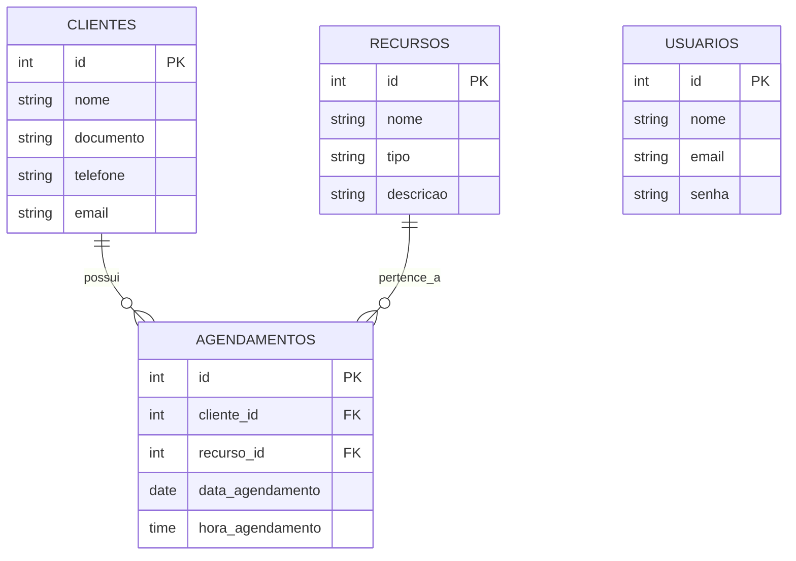

## 1. Requisitos Funcionais

| ID | Requisito | Descrição |
| - | - | - |
| RF01 | Autenticação de Usuário | Permite que o administrador realize login/logout com e-mail e senha |
| RF02 | Cadastro de Clientes | Permite cadastrar novos clientes informando nome, documento, telefone e e-mail |
| RF03 | Listar e Buscar Clientes | Exibe lista de clientes cadastrados e permite filtrar por nome ou documento |
| RF04 | Editar e Excluir de Clientes | Permite alterar os dados de um cliente existente ou remové-lo do sistema |
| RF05 | Listagem de Recursos | Busca e exibe os recursos disponíveis (Aparelhos/Especialistas) cadastrados no banco de dados |
| RF06 | Registro de Agendamento | Permite agendar uma sessão vinculando Cliente, Data, Hora e o Recurso (Equipamento/Especialista) |
| RF07 | Validação de Conflito de Horário | Bloqueia e emite um alerta automático caso o mesmo recurso já esteja agendado no mesmo dia e horário |
| RF08 | Histórico de Agendamentos | Exibe a listagem completa dos agendamentos realizados com data, hora, cliente e recurso |

## 2. Diagrama Entidade-Relacionamento

## 3. Banco de dados

CREATE TABLE usuarios (
    id SERIAL PRIMARY KEY,
    nome VARCHAR(100) NOT NULL,
    email VARCHAR(100) NOT NULL UNIQUE,
    senha VARCHAR(255) NOT NULL
);

CREATE TABLE clientes (
    id SERIAL PRIMARY KEY,
    nome VARCHAR(100) NOT NULL,
    documento VARCHAR(20) NOT NULL UNIQUE,
    telefone VARCHAR(20),
    email VARCHAR(100)
);

CREATE TABLE recursos (
    id SERIAL PRIMARY KEY,
    nome VARCHAR(100) NOT NULL,
    tipo VARCHAR(50) NOT NULL,
    descricao VARCHAR(255)
);

CREATE TABLE agendamentos (
    id SERIAL PRIMARY KEY,
    cliente_id INT NOT NULL REFERENCES clientes(id) ON DELETE CASCADE,
    recurso_id INT NOT NULL REFERENCES recursos(id) ON DELETE CASCADE,
    data_agendamento DATE NOT NULL,
    hora_agendamento TIME NOT NULL,
    CONSTRAINT unique_conflito_agendamento UNIQUE (recurso_id, data_agendamento, hora_agendamento)
);

INSERT INTO usuarios (nome, email, senha) VALUES 
('Administrador Clínica', 'admin@clinica.com', 'admin123');

INSERT INTO recursos (nome, tipo, descricao) VALUES 
('Studio Pilates - Cadilac / Reformer', 'Equipamento', 'Aparelhos completos para sessões de Pilates'),
('Dra. Camila Santos - RPG', 'Especialista', 'Atendimento individual de Reeducação Postural Global'),
('Dr. Roberto Lima - Acupuntura', 'Especialista', 'Sessões de acupuntura e ventosaterapia'),
('Estação de Eletroterapia (TENS / FES)', 'Equipamento', 'Aparelho de estimulação elétrica e analgesia'),
('Maca de Tração / Ultrassom Terapêutico', 'Equipamento', 'Equipamento para terapia combinada muscular e articular');

INSERT INTO clientes (nome, documento, telefone, email) VALUES 
('Maria Aparecida Silva', '123.456.789-00', '(19) 98765-4321', 'maria@email.com'),
('Carlos Eduardo Souza', '987.654.321-11', '(19) 99123-4567', 'carlos@email.com');