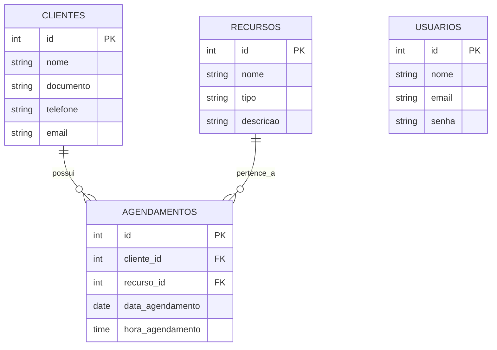

## 1. Requisitos Funcionais

| ID | Requisito | Descrição |
| - | - | - |
| RF01 | Autenticação de Usuário | Permite que o administrador realize login/logout com e-mail e senha |
| RF02 | Cadastro de Clientes | Permite cadastrar novos clientes informando nome, documento, telefone e e-mail |
| RF03 | Listar e Buscar Clientes | Exibe lista de clientes cadastrados e permite filtrar por nome ou documento |
| RF04 | Editar e Excluir de Clientes | Permite alterar os dados de um cliente existente ou remové-lo do sistema |
| RF05 | Listagem de Recursos | Busca e exibe os recursos disponíveis (Aparelhos/Especialistas) cadastrados no banco de dados |
| RF06 | Registro de Agendamento | Permite agendar uma sessão vinculando Cliente, Data, Hora e o Recurso (Equipamento/Especialista) |
| RF07 | Validação de Conflito de Horário | Bloqueia e emite um alerta automático caso o mesmo recurso já esteja agendado no mesmo dia e horário |
| RF08 | Histórico de Agendamentos | Exibe a listagem completa dos agendamentos realizados com data, hora, cliente e recurso |

## 2. Diagrama Entidade-Relacionamento

